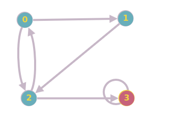

O algoritmo de pesquisa em largura (BFS) é usado para pesquisar uma estrutura de dados de árvore ou gráfico para um nó que atenda a um conjunto de critérios. Ele começa na raiz da árvore ou gráfico e procura/visita todos os nós no nível de profundidade atual antes de passar para os nós no próximo nível de profundidade. A busca em largura pode ser usada para resolver muitos problemas na teoria dos grafos.

# Exemplo

Entrada:

Saida: [2 0 3 1] Ordem dos grafos visitados