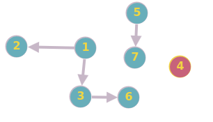

DFS com numeração é uma técnica usada para percorrer um grafo usando a busca em profundidade (DFS - Depth-First Search) e atribuir um número de ordem a cada vértice visitado. A ideia é que cada vértice receba um número que corresponde à ordem em que foi visitado pela busca em profundidade.

# Exemplo

Entrada:

Saida:
- Nó: 2 Numerado como: 1
- Nó: 4 Numerado como: 2
- Nó: 5 Numerado como: 3
- Nó: 7 Numerado como: 4
- Nó: 3 Numerado como: 5
- Nó: 6 Numerado como: 6
- Nó: 1 Numerado como: 7