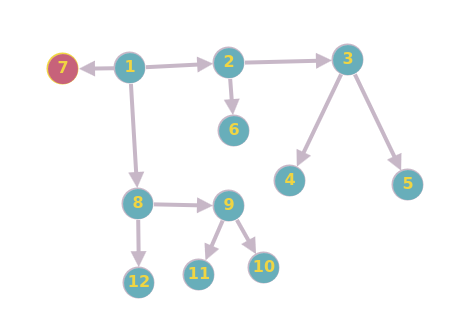

Depth first Search ou Busca em Profundidade é um algoritmo recursivo para pesquisar todos os vértices de um grafo ou estrutura de dados em árvore. Traversal significa visitar todos os nós de um grafo.

# Exemplo

Entrada:

Saida: [0 1 2 3 4 5 6 7 8 9 10 11 12] ordem dos grafos visitados