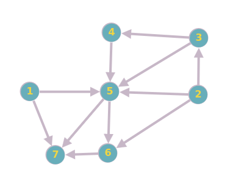

Ordem topológica é uma ordenação linear dos vértices de um grafo direcionado em que cada aresta segue da esquerda para a direita, ou seja, da cabeça para a cauda. Em outras palavras, se existe uma aresta que sai do vértice A e chega no vértice B, então o vértice A deve aparecer antes do vértice B na ordem topológica.

# Exemplo

Entrada:

Saida:['v1', 'v2', 'v3', 'v4', 'v5', 'v6', 'v7']