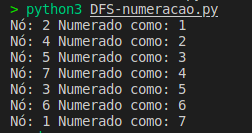

# ExerciciosWeb

**Número da Lista**: 1 
**Conteúdo da Disciplina**: Grafos 1 

## Alunos
|Matrícula | Aluno |
| -- | -- |
| 20/0057227  |  Caio Vitor Carneiro |
| 21/2008197  |  João Pedro Alves Machado |

## Sobre 
Escolhemos diversos exercicios da disciplina e da Web para exercutamos esse trabalho.

## Screenshots
# 
# 
# 
## Instalação 
**Linguagem**: Python 
**Framework**: (caso exista) 
na pasta do exercicio digite python3 (NomeDoExercicio)
Ex: python3 BFS.py